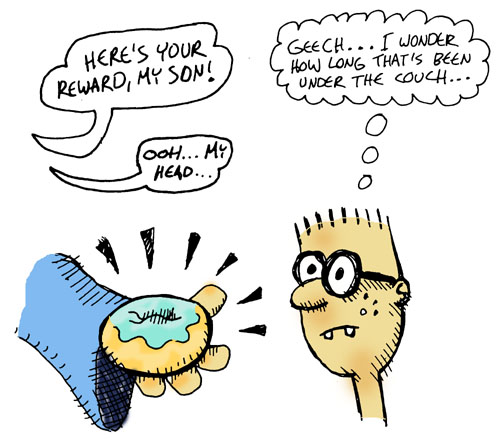

## Using OTP

Throughout the book, we avoided the fairly complicated topic of OTP (the means by which you can write fault-tolerant, production-ready applications in LFE). There are several great resources to learn of OTP (as provided at the end of the book), but it still felt negligent to show readers how to create a simple game server -- which, if used in production, would cause endless heartache -- and now show they how to do it "properly".

Thus, for the motivated reader, we include here a version of the game converted to LFE/OTP. An explanation of this code and what it does is beyond the scope of this mini-book, but there are plenty of good books where you can read about Erlang/OTP and apply this to what you've learned here, using the LFE/OTP game code to extend your knowledge.

The OTP version of the game is available in the ``code/spels`` directory. To run it, you will need to have ``rebar3`` installed on your machine.

To begin with, you'll fire up the LFE REPL:

```bash
$ make repl
```

This will download and compile all the necessary LFE dependencies and then put you into the REPL:

```
Erlang/OTP 17 [erts-6.2] [source] [64-bit] [smp:4:4] [async-threads:10]

   ..-~.~_~---..
  (      \\     )    |   A Lisp-2+ on the Erlang VM
  |`-.._/_\\_.-';    |   Type (help) for usage info.
  |         g (_ \   |
  |        n    | |  |   Docs: http://docs.lfe.io/
  (       a    / /   |   Source: http://github.com/rvirding/lfe
   \     l    (_/    |
    \   r     /      |   LFE v1.0 (abort with ^G)
     `-E___.-'

>
```

At this point, you can start the server and load the game commands:

```lisp
> (spels-game:start)
#(ok <0.36.0>)
> (include-lib "spels/include/commands.lfe")
loaded-game-commands
```

With the commands loaded, you're ready to play the game:


```lisp
> (look)
ok
>
You are in the living-room of a wizard's house. There is a wizard snoring
loudly on the couch.
You see a whiskey-bottle on the ground. You see a bucket on the ground.
There is a door going west from here. There is a stairway going upstairs from
here.
```


```lisp
> (go west)
ok
>
You are in a beautiful garden. There is a well in front of you.
You see a frog on the ground. You see a chain on the ground.
There is a door going east from here.
> (take chain)
ok

You are now carrying the chain.
> (go east)
ok
```

```lisp
You are in the living-room of a wizard's house. There is a wizard snoring
loudly on the couch.
You see a whiskey-bottle on the ground. You see a bucket on the ground.
There is a door going west from here. There is a stairway going upstairs from
here.
> (take 'bucket)
ok
>
You are now carrying the bucket.
> (go upstairs)
ok

You are in the attic of the wizard's house. There is a giant welding torch in
the corner.
There is a stairway going downstairs from here.
```

```lisp
> (weld chain bucket)
ok
>
You have achieved the 'weld-chain' goal!

The chain is now securely welded to the bucket.

> (go downstairs)
ok

You are in the living-room of a wizard's house. There is a wizard snoring
loudly on the couch.
There is a door going west from here. There is a stairway going upstairs from
here.
> (go west)
ok

You are in a beautiful garden. There is a well in front of you.
You see a frog on the ground.
There is a door going east from here.
```


```lisp
> (dunk bucket well)
ok

You have achieved the 'dunk-bucket' goal!

The bucket is now full of water.
> (go east)
ok

You are in the living-room of a wizard's house. There is a wizard snoring
loudly on the couch.
There is a door going west from here. There is a stairway going upstairs from
here.
```

```lisp
> (splash wizard bucket)
ok

You have achieved the 'splash-wizard' goal!

The wizard awakens from his slumber, greets you warmly, and thanks you for
pulling him out of a rather nasty dream.
Your reward, it seems, is a magical low-card donut which he hands you ...
right before drifting off to sleep again.

You won!!
```
