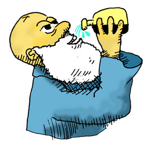

# Defining the Data for our Game World

In order to learn some more about forms, let's create a some forms that create the data for our game world. First of all, our game is going to have some objects in it that the player can pick up and use -- let's define those objects:

```lisp
(set *objects* '(whiskey-bottle bucket frog chain))
```
```lisp
(whiskey-bottle bucket frog chain)
```

Ok, now let's dissect this line an see what it means: Since a Lisp compiler always starts reading things in *Code Mode* and expects a form, the first symbol, ``set``, must be a command. In this case, the command sets a variable to a value: The variable is ``*objects*`` (Lispers like to put stars around the names for global variables as a convention; these are sometimes referred to as "ear muffs"). The value we are setting it to is a list of the four objects. Now, since the list is data (i.e. we don't want the compiler to try and call a function called ``whiskey-bottle``) we need to "flip" the compiler into ``Data Mode`` when reading the list. The single quote in front of the list is the command that tells the compiler to flip:


Now that we've defined some objects in our world, let's ramp it up a step and define a map of the actual world itself. Here is a picture of what our world looks like:


In this simple game, there will only be three different locations: A house with a living room and an attic, along with a garden. We're going to describe each of these, as well as provide metadata associated with them. We'll do that with something called a "record", a simple data structure in Erlang and LFE that lets us associate keys and values. Let's create a record for our places:

```lisp
> (defrecord place
    description
    exits)
```
```lisp
()
```

Great! Now we can define our places ... almost. What's the "exit" business? Well, if we're going to move about from place to place, we need to know what direction to go in, the object that lets us pass from one location to the next, and the final destination. Let's create another record for this data:

```lisp
> (defrecord exit
    direction
    object
    destination)
```
```lisp
()
```

Now we're ready to create our places!

```lisp
> (set living-room
    (make-place
      description (++ "You are in the living-room of a wizards house. "
                      "There is a wizard snoring loudly on the couch.")
      exits (list
              (make-exit
                direction 'west
                object 'door
                destination 'garden)
              (make-exit
                direction 'upstairs
                object 'stairway
                destination 'attic))))
```
```lisp
#(place
  "You are in the living-room of a wizards house. There is a wizard snoring loudly on the couch."
  (#(exit west door garden) #(exit upstairs stairway attic)))
```

Two more to go!

```lisp
> (set garden
    (make-place
      description (++ "You are in a beautiful garden. "
                      "There is a well in front of you.")
      exits (list
              (make-exit
                direction 'east
                object 'door
                destination 'living-room))))
```
```lisp
  "You are in a beautiful garden. There is a well in front of you."
  (#(exit east door living-room)))
```
```lisp
> (set attic
    (make-place
      description (++ "You are in the attic of the wizards house. "
                      "There is a giant welding torch in the corner.")
      exits (list
              (make-exit
                direction 'downstairs
                object 'stairway
                destination 'living-room))))
```
```lisp
#(place
  "You are in the attic of the wizards house. There is a giant welding torch in the corner."
  (#(exit downstairs stairway living-room)))
```

Now we can combine these to make our game map! Let's define a new variable called ``*map*`` that combines these together to give us a picture of our mini world:

```lisp
> (set *map* `(#(living-room ,living-room)
               #(gargen ,garden)
               #(attic ,attic)))
```

 Lists such as this are, not surprisingly, called "property lists" in LFE and Erlang. They can also be used as dictionaries. An property list is simply a list of *tuples* where the first item in each *tuple* is a "key" symbol that is associated with "values", a bunch of other data. Our three keys are the *atoms* ``living-room``, ``garden``, and ``attic``.

After we set that last variable, we will see the following output:

```lisp
(#(living-room
   #(place
     "You are in the living-room of a wizards house. There is a wizard snoring loudly on the couch."
     (#(exit west door garden) #(exit upstairs stairway attic))))
 #(gargen
   #(place
     "You are in a beautiful garden. There is a well in front of you."
     (#(exit east door living-room))))
 #(attic
   #(place
     "You are in the attic of the wizards house. There is a giant welding torch in the corner."
     (#(exit downstairs stairway living-room)))))
```

This map contains everything important that we'd like to know about our three locations: a unique name for the location (i.e. "house", "garden", and "attic") a short description of what we can see from there, plus the where and how of each path into/out of that place. Notice how information-rich this one variable is and how it describes all we need to know but not a thing more. Lispers love to create small, concise pieces of code that leave out any fat and are easy to understand just by looking at them.

Now that we have a map and a bunch of objects, it makes sense to create another variable that says where each of these object is on the map:

```lisp
> (set *object-locations* '(#(whiskey-bottle living-room)
                            #(bucket living-room)
                            #(chain garden)
                            #(frog garden)))
```
```lisp
(#(whiskey-bottle living-room)
 #(bucket living-room)
 #(chain garden)
 #(frog garden))
```

Here we have associated each object with a location, and we see the property list rear its head again!

Now that we have defined our world and the objects in the world, the only thing left to do is describe the location of the player of the game:

```lisp
> (set *location* 'living-room)
```
```lisp
living-room
```

Now let's begin making some game commands!


