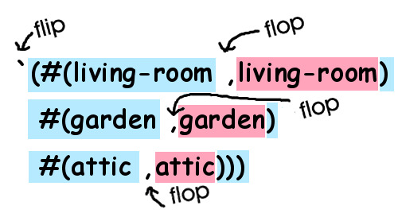

## Making the Game Map

Now we can combine the data we have defined to finally make our game map! Let's define a new variable called ``*map*`` that combines these together to give us a picture of our mini-world:

```lisp
> (set *map* `(#(living-room ,living-room)
               #(garden ,garden)
               #(attic ,attic)))
```

 Lists such as this are, not surprisingly, called "property lists" in LFE and Erlang. They can also be used as dictionaries (with the ``orddict`` module). A property list is simply a list of *tuples* where the first item in each *tuple* is a "key" *atom* that is associated with "values", a bunch of other data. Our three keys are the *atoms* ``living-room``, ``garden``, and ``attic``.

But there's more going on there, and it looks pretty strange: that's
*back-quoting* and *unquoting* you're seeing. Remember how we used a quote before to flip the compiler from *Code Mode* to *Data Mode*? Well, by using the the back-quote (the quote in the upper left corner of the keyboard) we can not only flip, but then also flop back into Code Mode by using a comma:



This "back-quoting" technique is a great feature in Lisp -- it lets us write code that looks just like the data it creates. This happens frequently with code written in a functional style: By building functions that *look* like the data they create, we can make our code easier to understand and also build for longevity: As long as the data doesn't change, the functions will probably not need to be refactored or otherwise changed, since they mirror the data so closely. Imagine how you'd write a function like this in VB or C: You would probably chop the path into pieces, then append the text snippets and the pieces together again- A more haphazard process that "looks" totally different from the data that is created and probably less likely to have longevity.

After we set that last variable, we will see the following output:

```lisp
(#(living-room
   #(place
     "You are in the living-room of a wizard's house. There is a wizard snoring loudly on the couch."
     (#(exit west door garden) #(exit upstairs stairway attic))))
 #(garden
   #(place
     "You are in a beautiful garden. There is a well in front of you."
     (#(exit east door living-room))))
 #(attic
   #(place
     "You are in the attic of the wizard's house. There is a giant welding torch in the corner."
     (#(exit downstairs stairway living-room)))))
```

This map contains everything important that we'd like to know about our three locations: a unique name for the location (i.e. "house", "garden", and "attic") a short description of what we can see from there, plus the where and how of each path into/out of that place. Notice how information-rich this one variable is and how it describes all we need to know but not a thing more. Lispers love to create small, concise pieces of code that leave out any fat and are easy to understand just by looking at them.

Now that we have a map and a bunch of objects, it makes sense to create another variable that says where each of these object is on the map:

```lisp
> (set *object-locations* '(#(whiskey-bottle living-room)
                            #(bucket living-room)
                            #(chain garden)
                            #(frog garden)))
```
```lisp
(#(whiskey-bottle living-room)
 #(bucket living-room)
 #(chain garden)
 #(frog garden))
```

Here we have associated each object with a location, and we see the property list rear its head again!

Now that we have defined our world and the objects in the world, the only thing left to do is describe the location of the player of the game:

```lisp
> (set *location* 'living-room)
```
```lisp
living-room
```

Now let's begin making some game commands!


