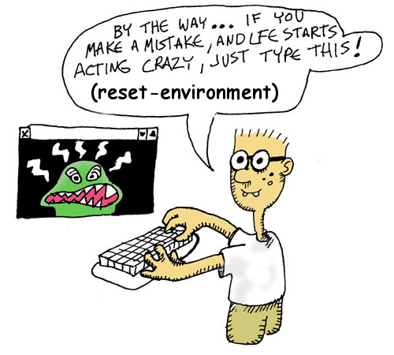

## Getting Set Up

If you're new to LFE and haven't read the [LFE Quick Start](http://lfe.gitbooks.io/quick-start/content/), that might be a
good idea to do that -- you'll feel much more comfortable with the material in
this book if you have. If you never encountered a Lisp before, or if your
familiarity is rusty, we'd recommend reading through the original [Casting
SPELs in Lisp](http://www.lisperati.com/casting.html). That version is more
accessible to the Lisp new-comer.

## Prerequisites

Here's what you need before we get started (links are to more resources,
should you be missing any of them):
 * Erlang needs to be installed on your system ([download](https://www.erlang-solutions.com/downloads/download-erlang-otp))
 * You need to have [git](http://git-scm.com/downloads)
 * Developer/build tools for your system (in particular, ``make``; instructions for this are very different between systems and can be found on the Web by searching for "install developer tools" or "build essential" for your operating system)


## Getting and Building LFE

Once all of the above are set up on your system, you're ready to get LFE:

```bash
$ mkdir -p ~/lab
$ cd ~/lab
$ git clone https://github.com/rvirding/lfe.git
$ cd lfe
$ make
```

## Starting the REPL

Are you ready? Oh, the *REPL*? That's an acronym that stands for *read-eval-print loop* -- it's where you can type LFE code interactively. Let's start it up!

```bash
$ ./bin/lfe
```
```lisp
Erlang/OTP 17 [erts-6.2] [source] [64-bit] [smp:8:8] [async...

LFE Shell V6.2 (abort with ^G)
>
```

We'll use it more soon, but for now you can try out a little addition:

```lisp
> (+ 2 2)
```
```lisp
4
```

We'll be writing our whole adventure game here in the REPL :-) Things should go very smoothly, but if you start exploring and things go nuts, you can reset your REPL to its default clean state with this command:

```lisp
> (reset-environment)
```
```lisp
ok
```



Keep in mind, though, this will clean *everything* up! You'll have to start over again!
