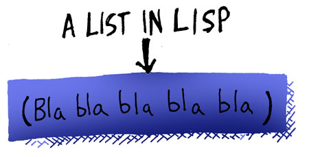

## Syntax and Semantics

Every computer language has code that is made up of *syntax* and *semantics*. The *syntax* of a programming language is the basic skeleton your program has to follow so that the compiler knows *what's what* in your program, so it can tell what's a function, a variable, etc. The *semantics* of a program is the more "random" stuff, like the different commands you have available and what variables you're allowed to look at at any point in the program. The first thing that is special about Lisp is that it has the simplest syntax of any major programming language.

Basically, the Lisp syntax dictates that any text you give the Lisp compiler has to be arranged into lists, which can be nested into lists of lists or such as needed. The parenthesis mark the beginning and end of each list:

Additionally, the Lisp compiler uses two modes when it reads your code: A *Code Mode* and a *Data Mode*. When you're in *Data Mode*, you can put anything you want into your lists. However, the compiler first starts off reading your code in *Code Mode*. In *Code Mode*, your lists need to be a special type of list called a *form*:

A form is a list where the first symbol in the list has to be a special word that the compiler can understand -- usually the name of a function. In this case, the compiler will send the other items of the list to the function as parameters. When it reads the text for these parameters, it will usually assume that they are also in *Code Mode*, unless you tell it to flip into data mode.
