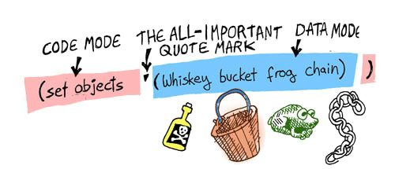

## Lay of the Land

As earlier stated, we're going to be creating a game. Our game is going to have some objects in it that the player can pick up and use. It's going to have places. It's going to have a player -- you! It's going to let you interact with it.

Things are going to get pretty deep, pretty quickly, so before we take the dive, let's cruise around in the shallow end. We're going to play in the LFE REPL a bit, defining some variables. Our game won't be using them in exactly this form. For now, though, it will be helpful for demonstrating a few things.

### Objects

Let's create some objects, a list of *atoms*:

```lisp
> (set objects '(whiskey-bottle bucket frog chain))
```
```lisp
(whiskey-bottle bucket frog chain)
```

Ok, now let's dissect this line an see what it means: Since a Lisp compiler always starts reading things in *Code Mode* and expects a form, the first symbol, ``set``, must be a command. In this case, the command sets a variable to a value: The variable is ``objects`` The value we are setting it to is a list of the four objects in our game. Now, since the list is data (i.e. we don't want the compiler to try and call a function with the name of ``whiskey-bottle``) we need to "flip" the compiler into *Data Mode* when reading the list. The single quote in front of the list is the command that tells the compiler to flip:




### Locations

In this simple game, there will only be three different locations: A house with a living room and an attic, along with a garden. Here is a picture of what our world looks like:


We're going to provide descriptions for each of these locations, as well as provide metadata associated with them. We'll do that later with something called *records*. But for now, just to get some practice with some of the basic concepts in Lisp, let's define three variables, each containing bogus data for our locations:

```lisp
> (set living-room "Super-cool data.")
> (set garden "Even cooler data.")
> (set attic "The best data evar.")
```

Now, assume we wanted to bring all of these together in yet another, mind-blowingly cool variable, ``state``:

```liap
> (set state `(#(living-room ,living-room)
               #(garden ,garden)
               #(attic ,attic)))
```

What's going on here? Well, we've defined what is called a "property list" in LFE, a list of key/value tuples. Our three *keys* are the atoms ``living-room``, ``garden``, and ``attic``. Our three *values* are the data stored in each of the variables.

But there's more going on there, and it looks pretty strange: that's back-quoting and unquoting you're seeing. Just like above, when we used a quote to flip the compiler from *Code Mode* to *Data Mode*, by using the the back-quote (the quote in the upper left corner of the keyboard) we can not only flip, but then also flop back into *Code Mode* by using a comma:


This "back-quoting" technique is a great feature in Lisp -- it lets us write code that looks just like the data it creates. This happens frequently with code written in a functional style: By building functions that *look* like the data they create, we can make our code easier to understand and also build for longevity: As long as the data doesn't change, the functions will probably not need to be refactored or otherwise changed, since they mirror the data so closely. Imagine how you'd write a function like this in VB or C: you would probably chop the path into pieces, then append the text snippets and the pieces together again -- a more haphazard process that "looks" totally different from the data that is created and probably less likely to have longevity.
