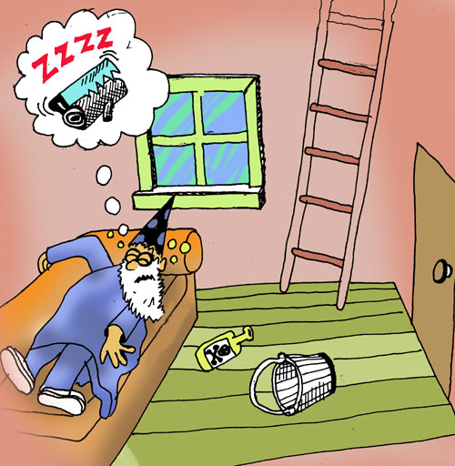

## Thinking in Patterns

We've learned how to get a description of all places, but how do we get just the description of just the place where our player is? We can apply our new knowledge:

1. Let's write a function that checks the player location against a ``place`` record to see if they're the same.
1. Then, let's use that function with a list of place records!

Here's the first part:

```lisp
(defun here?
  ((loc (match-place name place-name)) (when (== loc place-name))
      'true)
  ((_ _)
      'false))
```

That looks pretty wild, so let's pause while we go through it.

LFE supports something called *pattern matching* thanks to its heritage from Erlang (which got it from Prolog). Many of the Lisp forms in LFE support *pattern matching*, and one of those is a function definition: you can put patterns in a function's arguments when you define it. However, when you do this, you need to make some changes. That's why the function above looks funny, because of these changes: an extra set of parentheses is needed (if you're wondering why, it's because instead of just one set of arguments and a function body, patterns allow for *many* sets of arguments and corresponding bodies ... so the extra set of parentheses is like a list of function definitions).

Functions without pattern matching in their arguments look like this, as we saw previously:

```lisp
(defun <name> (<arg> ...)
  <body>)
```

Whereas functions *with* pattern matching in their arguments look like this:

```lisp
(defun <name>
  ((<pattern>)
    body)
  ((<pattern>)
    body)
  ...)
```

You can have as many different patterns and associated function bodies as you want -- as long as they all have the same number of arguments (also know as *arity*). Our function has two arguments (*2-arity*): a location ``loc`` and a pattern matching against a ``place`` record. Our pattern was a call to one of the magical functions created by our ``place`` record, ``match-place``. So what got filled in the ``<pattern>`` slot was a ``(match-place ...)`` call, and that explains why you saw three opening parentheses in a row.

But we've got something else new there, too: the ``when`` form. When you see a ``(when ...)`` after a pattern in LFE, it's called a *guard*. This guard is standing watch over the pattern, and will only let the pattern match if the location ``loc`` that was passed as a regular function argument is the same as the ``place`` record's ``location`` field.

Let's try it out against the first place in our ``state``'s ``places`` field:

```lisp
> (here? 'living-room (car (state-places state)))
true
> (here? 'attic (car (state-places state)))
false
```

``here?`` takes two arguments: a location name and a place record. Remember we wanted to be able to handle a list of places. We used ``lists:map`` before, but that's not exactly what we want here. What would be *perfect* is if we could find a function that would only return the items of a list that met certain criteria (in this case, the criteria is that the player location and the place record name are the same!).

It turns out there is *exactly* this function in the Erlang standard library: the ``lists:filter`` function. ``lists:filter`` takes two arguments:

1. A *predicate* function (a function that returns ``true`` or ``false``), given some input, and
1. A list of inputs to give the *predicate* function.

Let's create a function which uses ``lists:filter`` to only return the place that returns ``true`` when we ask ``here?``:

```lisp
(defun get-here
  (((match-state player player-loc places locs))
    (car (lists:filter
           (lambda (loc)
             (here? player-loc loc))
           locs))))
```

We used *pattern matching* again, but this time to do something a tiny bit clever: we used it to define the variables ``player-loc`` and ``locs``. In other words, with our pattern above, we said "When you get a ``state`` record coming through here, get its ``player`` field and assign it to the ``player-loc`` variable; also get its ``places`` field and assign it to the ``locs`` variable."



Now we can use this function to get the description of the player location:

```lisp
(defun describe-location (game-state)
  (++ (place-description (get-here game-state)) "\n"))
```

Now let's use our new function:

```lisp
> (describe-location state)
```
```lisp
"You are in the living-room of a wizard's house. There is a wizard snoring loudly on the couch."
```

Perfect! Just what we wanted.
