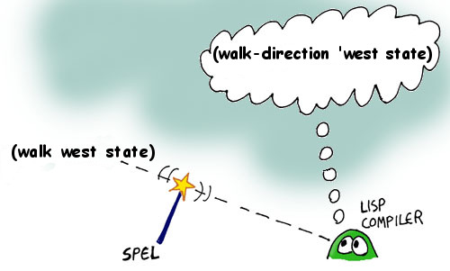

## Casting SPELs

Now we're going to learn an incredibly powerful feature of Lisp: Creating SPELs!

SPEL is short for "Semantic Program Enhancement Logic" and lets us create new behavior inside the world of our computer code that changes the Lisp language at a fundamental level in order to customize its behavior for our needs- It's the part of Lisp that looks most like magic. To enable SPELs, we first need to activate SPELs inside our Lisp compiler (Don't worry about what this line does -- advanced Lispers should click [here](../addendum/2-whyspels.md)):

Type this into your REPL:

```lisp
> (defmacro defspel body `(defmacro ,@body))
```
```
()
```

Ok, now that they're enabled, let's cast our first spell, called walk:


```lisp
(defspel walk (direction game-state)
  `(walk-direction ',direction ,game-state))
```

What this code does is it tells the Lisp compiler that the *atom* ``walk`` is not actually the *atom* ``walk`` but is, instead, ``walk-direction`` and that the direction actually has a quote in front of it, even though we can't see it. Basically we can sneak in some special code inbetween our program and the compiler that changes our code into something else before it is compiled:



Notice how similar this function looks to the code we had written before for ``describe-exit``. In Lisp, not only do code and data look a lot identical, but code and special commands to the compiler (the SPELs) look identical as well -- a very consistent and clean design!

Let's try our new spell:

```lisp
> (set state (walk east state))
```
```lisp
You are in the living-room of a wizard's house. There is a wizard 
   snoring loudly on the couch.
You see a whiskey-bottle on the ground. You see a bucket on the ground.
There is a door going west from here. There is a stairway going upstairs from here.
...
```

Much better!

Wait, why ``(set state ...)``? Remember: this is *functional programming*! We're not changing any global variables inside functions. So if our player walks, how do we make sure that the new state created by the ``walk`` SPEL is usable for the next command? We set the output of the ``walk`` SPEL (which is the new state) to the ``state`` variable!
