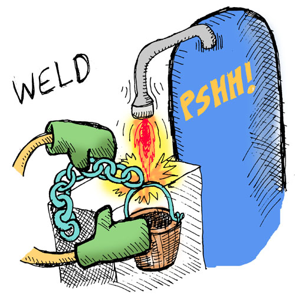

## Complex Interactions

We've just implemented some simple interactions like picking up objects or checking our player's inventory. What about interacting with the world on a conditional basis? We need add these sorts of actions to the game so that the player can meed the conditions to *win* in the game.

The first of these is the ability to weld the chain to the bucket in the attic:

```lisp
(defun weld-ready? (game-state)
  (andalso (inv? 'bucket game-state)
           (inv? 'chain game-state)
           (== (state-player game-state) 'attic)))
```

As you can see, that function checks to make sure that all the necessary conditions are present for a successful welding.

We're going to need some functions that print messages to the player; let's create those now:

```lisp
(defun weld-not-ready ()
  (io:format "~nYou seem to be missing a key condition for welding ...~n~n"))

(defun cant-weld ()
  (io:format "~nYou can't weld like that ...~n~n"))

(defun good-weld ()
  (io:format "~nThe chain is now securely welded to the bucket.~n~n"))

(defun already-welded ()
  (io:format "~nYou have already welded the bucket and chain!~n~n"))
```

And now for the welding!

```lisp
(defun weld-them
  ((_ _ (= (match-state chain-welded? 'true) game-state))
    (already-welded)
    game-state)
  (('chain 'bucket game-state)
    (case (weld-ready? game-state)
        ('true
          (good-weld)
          (set-state-chain-welded? game-state 'true))
        ('false
          (weld-not-ready)
          game-state)))
  ((_ _ game-state)
    (cant-weld)
    game-state))
```

We've pieced together all our function parts to give our game a new action. The one thing in this code you haven't yet seen is the odd ``(= ...)`` form -- that's not an equality test! In LFE, you can test if two things are equal with ``(== ...)`` or ``(=:= ...)``. So what is ``(= ...)``, then?

If you look at it, you see that it's wrapping a record matching in the function arguments. In our match, we only care about one field from the record: ``chain-welded?``. And we only care if it's ``true``. Let's say our match succeeds, that the chain is already welded ... now what? We don't have any variables defined! Our function needs to return the game state, so how do we get it?

In LFE record-matching, you have the ability to not only match individual fields from a record, but to wrap the whole matching up and assign the passed record to a variable. You do that with the ``(= ...)`` form!



Let's try our new command:


```lisp
> (weld-them 'chain 'bucket state)
```
```lisp
You seem to be missing a key condition for welding ...
```

Oops... we're don't have a bucket or chain, do we? ...and there's no welding machine around... oh well...

Now let's create a command for dunking the chain and bucket in the well. We'll need similar functions for this action:

```lisp
(defun dunk-ready? (game-state)
  (andalso (inv? 'bucket game-state)
           (== (state-chain-welded? game-state) 'true)
           (== (state-player game-state) 'garden)))

(defun dunk-not-ready ()
  (io:format "~nYou seem to be missing a key condition for dunking ...~n~n"))

(defun cant-dunk ()
  (io:format "~nYou can't dunk like that ...~n~n"))

(defun good-dunk ()
  (io:format "~nThe bucket is now full of water.~n~n"))

(defun already-dunked ()
  (io:format "~nWhy did you re-fill the bucket?~n~n"))

(defun dunk-it
  ((_ _ (= (match-state bucket-filled? 'true) game-state))
    (already-dunked)
    game-state)
  (('bucket 'well game-state)
    (case (dunk-ready? game-state)
        ('true
          (good-dunk)
          (set-state-bucket-filled? game-state 'true))
        ('false
          (dunk-not-ready)
          game-state)))
  ((_ _ game-state)
    (cant-dunk)
    game-state))
```

Hrm ... what can we do about that repititive code?

