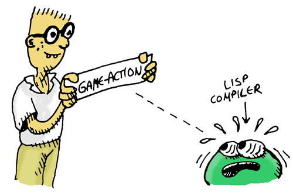

## Creating Special Actions

Before we tackle the issue of always setting the game ``state`` with every game command we type, we need to do one more thing: add some special actions to the game that the player has to do to win in the game. The first command will let the player weld the chain to the bucket in the attic:

```lisp
(defun weld-them (item-1 item-2 game-state)
  )
```

As you can see, that function checks to make sure that all the necessary conditions are present for a successful welding.


Let's try our new command:


```lisp
> (weld 'chain 'bucket state)
```

```lisp
```

Oops... we're don't have a bucket or chain, do we? ...and there's no welding machine around... oh well...

Now let's create a command for dunking the chain and bucket in the well:

```lisp
(defun dunk )
```

Now if you paid attention, you probably noticed that this command looks a lot like the weld command... Both commands need to check the location, subject, and object- But there's enough making them different enough so that we can't combine the similarities into a single function. Too bad...

...but since this is Lisp, we can do more than just write functions, we can cast SPELs! Let's create the following SPEL:

```lisp
(defspel game-action ...
  )
```

Notice how ridiculously complex this SPEL is- It has more weird quotes, backquotes, commas and other weird symbols than you can shake a list at. More than that it is a SPEL that actually cast ANOTHER SPEL! Even experienced Lisp programmers would have to put some thought into create a monstrosity like this (and in fact they would consider this SPEL to be inelegant and would go through some extra esoteric steps to make it better-behaved that we won't worry about here...)




The point of this SPEL is to show you just how sophisticated and clever you can get with these SPELs. Also, the ugliness doesn't really matter much if we only have to write it once and then can use it to make hundreds of commands for a bigger adventure game.

Let's use our new SPEL to replace our ugly ``weld-them`` command:

```lisp

```

Look at how much easier it is to understand this command- The game-action SPEL lets us write exactly what we want to say without a lot of fat- It's almost like we've created our own computer language just for creating game commands. Creating your own pseudo-language with SPELs is called Domain Specific Language Programming, a very powerful way to program very quickly and elegantly.

```lisp
> (weld chain bucket)
```
```
```

...we still aren't in the right situation to do any welding, but the command is doing its job!


Next, let's rewrite the ``dunk`` command as well:

```lisp

```

Notice how the ``weld`` command had to check whether we have the subject, but that the ``dunk`` command skips that step -- our new ``game-action`` SPEL makes the code easy to write and understand.


And now our last code for splashing water on the wizard:


```lisp

```
