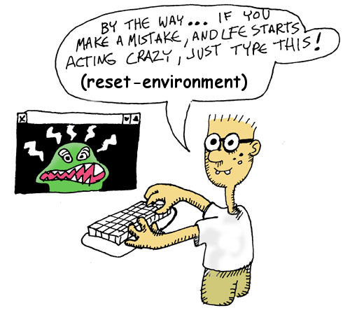

# Starting the REPL

Now that you've built a release, you're ready to start hacking in the REPL! Right? Oh, the *REPL*? That's an acronym that stands for *read-eval-print loop* -- it's where you can type LFE code interactively. 

Let's start it up:

```bash
rebar3 lfe repl
```
```lisp
Erlang/OTP 23 [erts-11.0] [source] [64-bit] [smp:16:16] [ds:16:16:10] [async-threads:1] [hipe]

   ..-~.~_~---..
  (      \\     )    |   A Lisp-2+ on the Erlang VM
  |`-.._/_\\_.-':    |   Type (help) for usage info.
  |         g |_ \   |
  |        n    | |  |   Docs: http://docs.lfe.io/
  |       a    / /   |   Source: http://github.com/rvirding/lfe
   \     l    |_/    |
    \   r     /      |   LFE v1.3-dev (abort with ^G)
     `-E___.-'

lfe>
```

You'll see some messages about deployment as well as applications being booted up; you can ignore all of those.
For now, though, try out a little addition:

```lisp
lfe> (+ 2 2)
```
```lisp
4
```

We'll be writing our whole adventure game here in the REPL :-) Things should go very smoothly, but if you start exploring and things go nuts, you can reset your REPL to its default clean state with this command:

```lisp
lfe> (reset-environment)
```
```lisp
ok
```



Keep in mind, though, this will clean *everything* up! You'll have to start over again!

Next, let's learn a litte bit about Lisp ...
