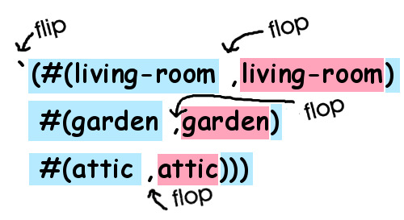

# Locations

In this simple game, there will only be three different locations: A house with a living room and an attic, along with a garden. Here is a picture of what our world looks like:


We're going to provide descriptions for each of these locations, as well as provide metadata associated with them. We'll do that later with something called *records*. But for now, just to get some practice with some of the basic concepts in Lisp, let's define three variables, each containing bogus data for our locations:

```lisp
lfe> (set living-room "Super-cool data.")
lfe> (set garden "Even cooler data.")
lfe> (set attic "The best data evar.")
```

Now, assume we wanted to bring all of these together in yet another, mind-blowingly cool variable, ``state``:

```liap
lfe> (set state `(#(living-room ,living-room)
               #(garden ,garden)
               #(attic ,attic)))
```

What's going on here? Well, we've defined what is called a "property list" in LFE, a list of key/value tuples. Our three *keys* are the atoms ``living-room``, ``garden``, and ``attic``. Our three *values* are the data stored in each of the variables.

But there's more going on there, and it looks pretty strange: that's back-quoting and unquoting you're seeing. Just like above, when we used a quote to flip the compiler from *Code Mode* to *Data Mode*, by using the back-quote (the quote in the upper left corner of the keyboard) we can not only flip, but then also flop back into *Code Mode* by using a comma:



This "back-quoting" technique is a great feature in Lisp -- it lets us write code that looks just like the data it creates. This happens frequently with code written in a functional style: By building functions that *look* like the data they create, we can make our code easier to understand and also build for longevity: As long as the data doesn't change, the functions will probably not need to be refactored or otherwise changed, since they mirror the data so closely. Imagine how you'd write a function like this in VB or C: you would probably chop the path into pieces, then append the text snippets and the pieces together again -- a more haphazard process that "looks" totally different from the data that is created and probably less likely to have longevity.
