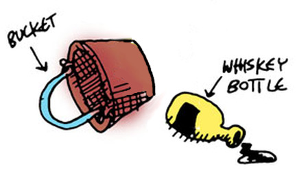

## Interacting

Now we'll create a command to pick up objects in our world. We'll need some helper functions for this. To help think about which helper functions we need to create, let's list the things we need to do:

1. Check to see if the item we seek is present
1. Set the object location of ``player`` for the object we seek
1. Update the list of objects
1. Update the game state


```lisp
(defun good-pick (item-name)
  (io:format "~nYou are now carrying the ~s.~n"
             (list (atom_to_list item-name))))

(defun check-item
  ((item-name (= (match-object name obj-name) obj)) (when (== item-name obj-name))
    (good-pick item-name)
    (set-object-location obj 'player))
  ((_ obj) obj))
```

We saw something like this before, with our function that conditionally printed a new line. In ``check-item/2``, there are two matches against function arguments: one is checking the value of a passed object name and the record's object name; the other doesn't care. If there's no match with the object name, the state isn't updated -- the old state is simply returned.

Here are some more helper functions we'll need:

```lisp
(defun update-items (item-name game-state)
  (lists:map
    (lambda (obj) (check-item item-name obj))
    (state-objects game-state)))

(defun get-item-names (game-state)
  (lists:map
    (lambda (x) (object-name x))
    (whats-here? game-state)))

(defun bad-pick ()
  (io:format "~nThat item is not here.~n"))
```

That's all the helper functions we need; now for the main attraction:

```lisp
(defun pickup-item
  ((item-name (= (match-state player-location player-loc objects objs) game-state))
    (case (lists:member item-name (get-item-names game-state))
          ('true
            (set-state-objects
              game-state (update-items item-name game-state)))
          ('false
            (bad-pick)
            game-state))))
```

Our ``pickup-item`` function takes two arguments:

1. the name of an item, and
1. the game state record

But it's also doing some pattern matching: its extracting the player's current location as well as the list of objects in the game. Then it checks to see if the item passed as an argument is in present in the player's current location.



Now let's cast another SPEL to make the command easier to use:

```lisp
(defspel pickup (item-name game-state)
  `(pickup-item ',item-name ,game-state))
```

Now let's try our new SPEL:

```lisp
lfe> (pickup whiskey-bottle state)
```
```lisp
You are now carrying the whiskey-bottle.
...
```

Again,for now  we're going to keep ignoring the state data that is returned with each of our commands -- we'll be taking care of that in the next chapter!

```lisp
lfe> (pickup frog state)
```
```lisp
That item is not here.
...
```

Now let's add a couple more useful commands: first, a command that lets us see our current inventory of items we're carrying (with the obligatory helper functions first!):

```lisp
(defun inv-obj
  (((match-state objects objs))
    (lists:filter
      (match-lambda
        (((match-object location 'player)) 'true)
        ((_) 'false))
      objs)))

(defun inv-name (game-state)
  (lists:map
    (lambda (x) (object-name x))
    (inv-obj game-state)))

(defun get-inv-str (game-state)
  (string:join
    (lists:map
      (lambda (x) (++ " - " (atom_to_list x) "\n"))
      (inv-name game-state))
    ""))
```

Did you notice our ``inv-obj`` helper function has a ``match-lambda``? In LFE, you can even do pattern matching in *anonymous functions*!

```lisp
(defun display-inv (game-state)
  (let ((inv-str (get-inv-str game-state)))
    (case inv-str
      ('() (io:format "~nYou are not carrying anything.~n"))
      (_ (io:format "~nYou are carrying the following:~n~s"
                    (list inv-str))))))
```

Try it out:

```lisp
lfe> (display-inv state)
```
```lisp
You are not carrying anything.
```

Now pick up the bucket and try again:

```lisp
lfe> (set state (pickup bucket state))
```
```lisp
You are now carrying the bucket.
...
```
```lisp
lfe> (display-inv state)
```
```lisp
You are carrying the following:
 - bucket
```

Now a function that tells us if we have a certain object on us:

```lisp
(defun inv? (item-name game-state)
  (lists:member item-name (inv-name game-state)))
```

Try it out:

```lisp
lfe> (inv? 'bucket state)
```
```lisp
true
```
```lisp
lfe> (inv? 'chain state)
```
```lisp
false
```
