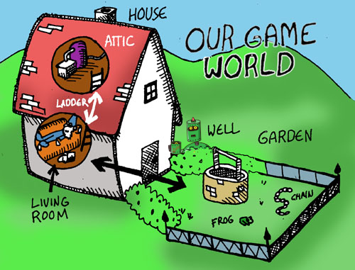
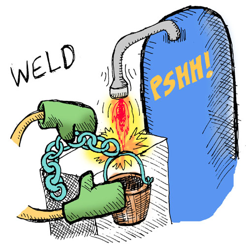

# Winning Play-Through

If you have any problems at this point, you can still play through the game: all you need to do is load the code from the gamefile provided in the code repository for this book:

```bash
$ git clone https://github.com/lfe/casting-spels.git
$ cd casting-spels
$ /path/to/your/lfe-dir/bin/lfe
```

Then, in the LFE REPL, do this:

```lisp
lfe> (run "code/game.lfe")
game-data-loaded
```

And you're ready to go!

Let's start:



```lisp
lfe> (look)
------------------------------------------------------------------------------
lfe>
You are in the living-room of a wizard's house. There is a wizard snoring
loudly on the couch.
You see a whiskey-bottle on the ground. You see a bucket on the ground.
There is a door going west from here. There is a stairway going upstairs from
here.
```


```lisp
(go west)
------------------------------------------------------------------------------
lfe>
You are in a beautiful garden. There is a well in front of you.
You see a frog on the ground. You see a chain on the ground.
There is a door going east from here.
(take chain)
------------------------------------------------------------------------------
lfe>
You are now carrying the chain.
(go east)
------------------------------------------------------------------------------
lfe>
You are in the living-room of a wizard's house. There is a wizard snoring
loudly on the couch.
You see a whiskey-bottle on the ground. You see a bucket on the ground.
There is a door going west from here. There is a stairway going upstairs from
here.
```


```lisp
(take bucket)
------------------------------------------------------------------------------
lfe>
You are now carrying the bucket.
(go upstairs)
------------------------------------------------------------------------------
lfe>
You are in the attic of the wizard's house. There is a giant welding torch in
the corner.
There is a stairway going downstairs from here.
```



```lisp
(weld chain bucket)
------------------------------------------------------------------------------
lfe>
You have achieved the 'weld-chain' goal!

The chain is now securely welded to the bucket.
(go downstairs)
------------------------------------------------------------------------------
lfe>
You are in the living-room of a wizard's house. There is a wizard snoring
loudly on the couch.
You see a whiskey-bottle on the ground.
There is a door going west from here. There is a stairway going upstairs from
here.
(go west)
------------------------------------------------------------------------------
lfe>
You are in a beautiful garden. There is a well in front of you.
You see a frog on the ground.
There is a door going east from here.
```


```lisp
(dunk bucket well)
------------------------------------------------------------------------------
lfe>
You have achieved the 'dunk-bucket' goal!

The bucket is now full of water.
(go east)
------------------------------------------------------------------------------
lfe>
You are in the living-room of a wizard's house. There is a wizard snoring
loudly on the couch.
You see a whiskey-bottle on the ground.
There is a door going west from here. There is a stairway going upstairs from
here.
```


```lisp
(splash wizard bucket)
------------------------------------------------------------------------------
lfe>
You have achieved the 'splash-wizard' goal!

The wizard awakens from his slumber, greets you warmly, and thanks you for
pulling him out of a rather nasty dream.
Your reward, it seems, is a magical low-carb donut which he hands you ...
right before drifting off to sleep again.

You won!!
```


